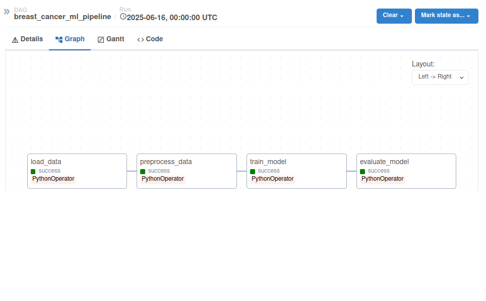

# Data_Engineering_project
*Работа выполнялась на виртуальной машине Linux Ubuntu. Airflow запускался через UI вебсервера, файлы логов и результатов пайплайна сохранялись на локальном диске.*

## 0. Логика репозитория
- [**dags/**](./dags/):
  - [main.py](./dags/main.py) с оркестрацией пайплайна.
  - [etl/](./dags/etl) с файлами ETL-компонентов:
    - [Load.py](./dags/etl/Load.py) с функцией загрузки.
    - [Preprocessing.py](./dags/etl/Preprocessing.py) с функцией предобработки данных и разбития на выборки.
    - [Training.py](./dags/etl/Training.py) с функцией обучения и сохранения модели.
    - [Evaluation.py](./dags/etl/Evaluation.py) с функцией тестирования модели, вычисления и сохранения метрик.
- [**logs/**](./logs/):
  - [dag_id=breast_cancer_ml_pipeline/](./logs/dag_id=breast_cancer_ml_pipeline/) с сохранением логов на каждом этапе ETL:
    - [task_id=load_data/](./logs/dag_id=breast_cancer_ml_pipeline/run_id=scheduled__2025-06-15T00_00_00+00_00/task_id=load_data/) - логи при загрузки данных.
    - [task_id=preprocess_data/](./logs/dag_id=breast_cancer_ml_pipeline/run_id=scheduled__2025-06-15T00_00_00+00_00/task_id=preprocess_data/) - логи при предобработке данных.
    - [task_id=train_model/](./logs/dag_id=breast_cancer_ml_pipeline/run_id=scheduled__2025-06-15T00_00_00+00_00/task_id=train_model/) - логи при обучении и сохранении модели.
    - [task_id=evaluate_model/](./logs/dag_id=breast_cancer_ml_pipeline/run_id=scheduled__2025-06-15T00_00_00+00_00/task_id=evaluate_model/) - логи при тестировании модели и подсчете метрик.
  - [scheduler/](./logs/scheduler/) с сохранением логов scheduler:
    - [2025-06-17/scheduler/](./logs/scheduler/2025-06-17/main.py.log) - сохранение логов файла с оркестрацией пайплайна.
- [**results/**](./results/):
  - [breast_cancer_model.pkl](./results/breast_cancer_model.pkl) - сохраненная модель.
  - [features.csv](./results/features.csv) - сохраненные при загрузки признаки датасета.
  - [target.csv](./results/target.csv) - сохраненная при загрузке целевая переменная датасета.
  - [model_metrics.json](./results/model_metrics.json) - сохраненные метрики.
  - [features_info.csv](./results/features_info.csv) - .info признаков.
  - [features_describe.csv](./results/features_describe.csv) - .describe признаков.
  - [figure.pdf](./results/figure.pdf) - распределение целевой переменной.
- [webserver_config.py](./webserver_config.py) - файл конфигурации вебсервера airflow.
- [requirements.txt](./requirements.txt).
      
## 1. Планирование пайплайна.
*Решается задача бинарной классификации наличия рака груди.*

### Описание датасета.
*[Датасет](https://scikit-learn.org/stable/modules/generated/sklearn.datasets.load_breast_cancer.html) числовых характеристик, полученных со снимка груди, для классификации наличия рака груди. Описательные харакетристики в [features_info.csv](./results/features_info.csv), [features_describe.csv](./results/features_describe.csv), [figure.pdf](./results/figure.pdf) файлах.*

- Датасет размером 569x30. Целевой переменной является target с бинарным значением наличия рака груди.
- Наличие рака в целевой переменной распределно в соотношении 2 к 1.
- Признаки имеют тип данных float64.
  
### Описание структуры пайплайна.
- Структура пайплана состоит из 4-х ETL компонентов:
  - Загрузка данных, сохранение описательных харакетристик датасета и сохранение признаков и целевой переменной в формате .csv.
  - Предобработка данных, включающая в себя удаление строк с нулевыми значениями, обработку категориальных данных при наличии, нормализацию и дробление на тестовую и обучающую выборки. Полученные выборки передаются в следующие компоненты обучения и тестирования модели.
  - Обучение модели логистической регрессии и сохранение модели в пикл-файле.
  - Тестирование модели для расчета метрик Accuracy, Precision, Recall, F1 с сохранением в формате .json.
    
### Схема пайплайна.

## 2. Разработка ETL-компонентов.
*Компоненты могут воспроизводиться независимо друг от друга и в Airflow оркестрируются при помощи DAG в [main.py](./dags/main.py). Каждый компонент содержит функцию, вызываемую при оркестрации.*

### Load.py
*В рамках проекта загрузка данных происходит из типового датасета библиотеки sklearn [load_breast_cancer](https://scikit-learn.org/stable/modules/generated/sklearn.datasets.load_breast_cancer.html), поэтому алгоритма задания пути к файлу/считывания файла не предусмотрено.*

- Файл содержит функцию load_data() без входных аргументов. 
- Извлекаются признаки в формате DataFrame для сохранения .info() и .describe().
- Извлекается целевая переменная и сохраняется его распределение .hist() в .pdf.
- Функция возвращает признаки и целевую переменную.
- При успешном выполнении выводится соответствующая запись в логи. То же самое при ошибке в коде с записью самой ошибки.

### Preprocessing.py
- Файл содержит функцию preprocess() c двумя входными аргументами: feature и target, полученных из [Load.py](./dags/etl/Load.py).
- Удаляются строки с нулевыми значениями, при наличии признака с типом данных object применяется LabelEncoding для перевода в числовой формат данных.
- С помощью StandardScaler данные нормализуются.
- Функция возвращает 4 массива numpy при помощи train_test_split(X, y, test_size=0.2).
- При успешном выполнении выводится соответствующая запись в логи. То же самое при ошибке в коде с записью самой ошибки.

### Training.py
- Файл содержит функцию train_model() с тремя входными аргументами: X_train, y_train, полученных из [Preprocessing.py](./dags/etl/Preprocessing.py), и model_name, задаваемую через airflow.variables через ключ model_name (по-умолчанию breast_cancer_model).
- Объявляется модель логистической регрессии и обучается на входной выборке.
- Обученная модель сохраняется в пикл-файл при помощи библиотеки joblib.
- При успешном выполнении выводится соответствующая запись в логи. То же самое при ошибке в коде с записью самой ошибки.

### Evaluation.py
- Файл содержит функцию evaluate() с четырьмя входными аргументами: X_test, y_test, полученных из [Preprocessing.py](./dags/etl/Preprocessing.py), model_name и metrics_name, задаваемые через airflow.variables через ключи model_name и metrics_name соответственно (по-умолчанию breast_cancer_model и model_metrics).
- Полученные тестовые признаки используются для предсказания в открытой через имя модели.
- Расчитываются метрики Accuracy, Precision, Recall, F1 на основе реальных тестовых данных и предсказанных и сохраняются в json файл.
- При успешном выполнении выводятся метрики в логи. При ошибке в коде выводится запись самой ошибки.

## 3. Оркестрация пайплайна с помощью Airflow.
*Оркестрация реализована через DAG-файл [main.py](./dags/main.py).*

### [/dags/main.py](./dags/main.py)
- Файл содержит задание пути для папки [results/](./results/).
- Структура файла состоит из тасков для передачи во входные аргументы функций возвращаемые значения предыдущими функциями через XCom.
  - Внутри каждого таска импортируется необходимый файл.
  - В preprocess_task, train_model_task, evaluation_task получаются входные аргументы через xcom_pull, возвращенные одной из предыдущих функций.
  - В train_model_task и evaluation_task через Variable получаются необходимые для функции входные аргументы названия модели и файла метрик. При отсутствии заданных имен возвращаются дефолтные значения.
  - Вызывается соответствующая таску функция компонента ETL с передачей нужных аргументов.
  - Возвращенные значения сохраняются в XCom при помощи xcom_push.
- DAG содержит PythonOperator, соответствующий каждому ETL-компоненту. 
  - Помимо id задается python_callable для вызова таска.
  - provide_context=True для передачи аргументов между функциями.
  - В аргументах DAG задается schedule_interval='@daily'.
- Порядок выполнения: load_data >> preprocess_data >> train_model >> evaluate_model
- Для обработки и логирования ошибок реализован task_failure_alert.
  
### Описание зависимостей
*Таски передают аргументы между компонентами через XCom*

- [Load.py](./dags/etl/Load.py) **возвращает** feature и target в формате .csv.
  - [Preprocessing.py](./dags/etl/Preprocessing.py) **принимает** аргументы feature и target.
- [Preprocessing.py](./dags/etl/Preprocessing.py) **возвращает** X_train, y_train, X_test, y_test.
  - [Training.py](./dags/etl/Training.py) **принимает** аргументы X_train, y_train и model_name из airflow.variables.
  - [Evaluation.py](./dags/etl/Evaluation.py) **принимает** аргументы X_test, y_test
- [Training.py](./dags/etl/Training.py) **возвращает** аргументы model_name.
  - [Evaluation.py](./dags/etl/Evaluation.py) **принимает** аргумент model_name.
- [Evaluation.py](./dags/etl/Evaluation.py) **принимает** аргумент metrics_name из airflow.variables.
- load_data >> preprocess_data >> train_model >> evaluate_model
  
### Описание логирования
*Логирование происходит через logging. Логи содержатся в [logs/](./logs/).*

- Логирование происходит на каждом ETL-компоненте в отдельном файле.
  - Начало и успешное/неуспешное выполнение компонента логируется - в последнем случае логируется ошибка.
- При возникновении ошибки on_failure_callback, task_failure_alert логирует ошибку для определенного таска.

## 4. Выгрузка результатов на локальный диск.
*Все результаты выгружаются в локальную папку results/*

### /results/
- [breast_cancer_model.pkl](./results/breast_cancer_model.pkl) - сохраненная модель.
- [features.csv](./results/features.csv) - сохраненные при загрузки признаки датасета.
- [target.csv](./results/target.csv) - сохраненная при загрузке целевая переменная датасета.
- [model_metrics.json](./results/model_metrics.json) - сохраненные метрики.
- [features_info.csv](./results/features_info.csv) - .info признаков.
- [features_describe.csv](./results/features_describe.csv) - .describe признаков.
- [figure.pdf](./results/figure.pdf) - распределение целевой переменной.
  
## 5. Анализ ошибок и устойчивости.
*Каждая ошибка в процессе записывается в логах, в том числе в логах каждого ETL-компонента.
### Где может "упасть" процесс?
- Не удалось прочесть данные из датасета -> реализован retires: 3 с retry_delay: timedelta(minutes=5).
- Пустой датасет -> проверка на .empty с ValueError("Данные пусты!").
- Наличие нулевых данных -> удаление строк с нулевыми значениями.
- Наличие категориальных данных -> LabelEncoding для признаков типа object.

### Описание исключений
Помимо отдельного ValueError для пустых данных, остальные исключения ловятся через конструкцию try-except и логируются через logger.error(f"*: {str(e)}").
